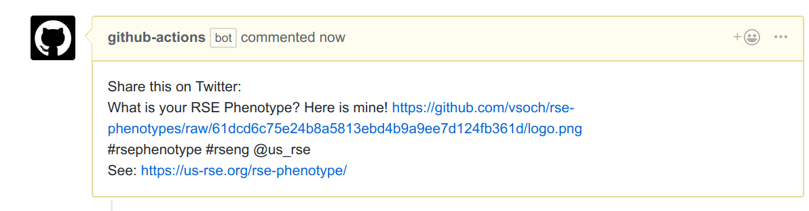

# Share Tweet with Link

This action will allow you to share a Tweet with one or more files
that are added and merged that match a pattern. It doesn't create any fancy 
link, but just gives the user text to copy paste when the pull request
is merged:



Here is an example of what to put in your `.github/main.workflow` file to
trigger the action.

```
workflow "share tweet button" {
  on = "pull_request"
  resolves = ["share button on merge"]
}

action "share button on merge" {
  uses = "vsoch/twitter-share-action/pull_request_share@master"
  secrets = ["GITHUB_TOKEN"]
  env = {
    MATCH_PATTERN = "*.png"
    HASHTAGS = "#rseng #rsephenotype"
    CUSTOM_MESSAGE = "What is your RSE Phenotype? Here is mine!"
    DATA_URL = "https://www.github.com/vsoch/twitter-share"
    AT_USERNAME = "@vsoch"
  }
}
```

By default, the pattern to be matched against files is `*.png`, and
the message and hashtag aren't defined. The data url should be any URL you want
to share, and the AT_USERNAME should be the account you want to @.
